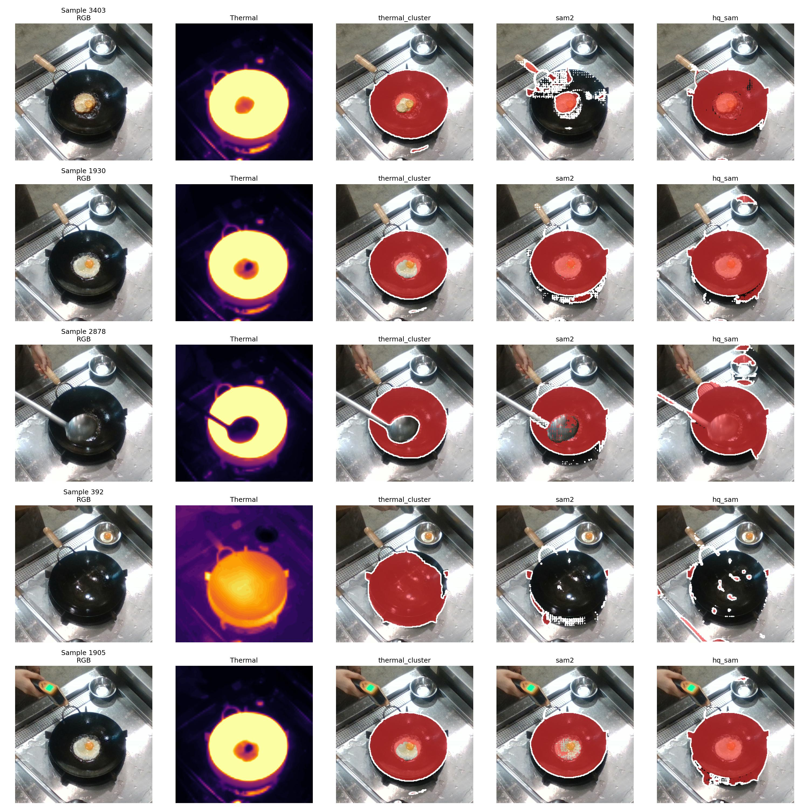
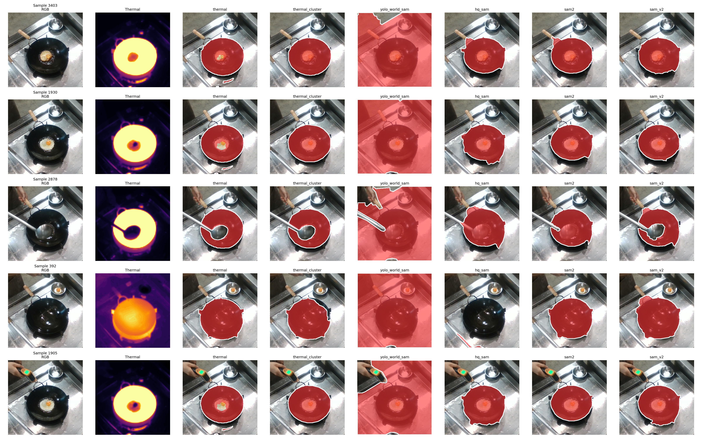
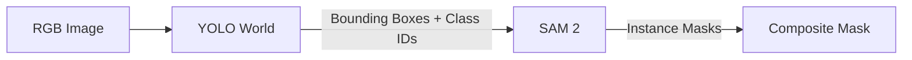
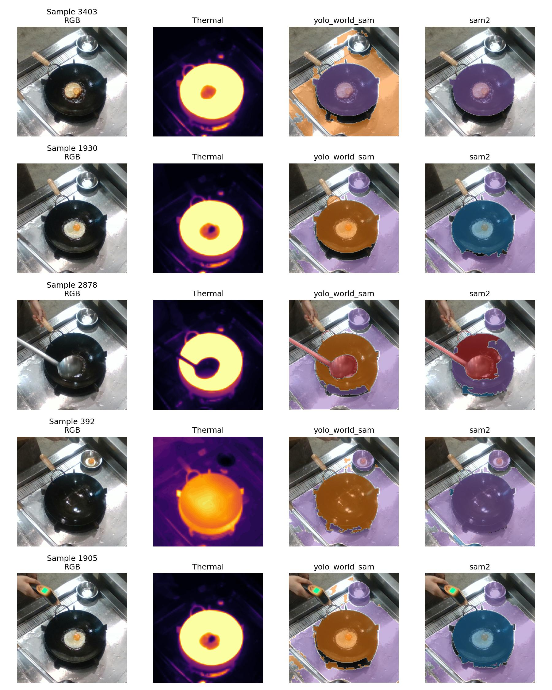
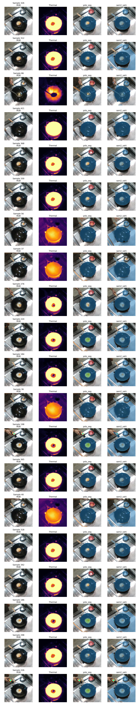
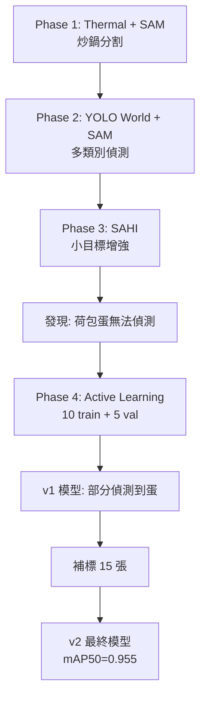
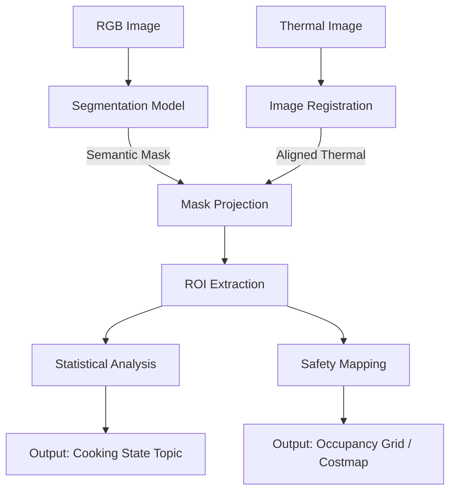
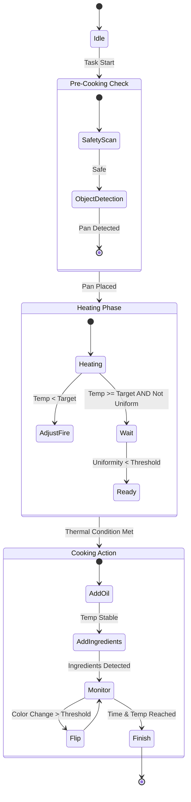

# ROS2 Cooking Perception

## 環境設定 (Environment Setup)

```bash
# 啟動虛擬環境
activate_venv ros2
```

**硬體環境**：
- **GPU**: NVIDIA GPU with CUDA 12.4
- **OS**: Linux (Ubuntu)

**Python 套件 (`uv pip list`)**：

| Package | Version | 用途 |
| --- | --- | --- |
| torch | 2.5.1+cu124 | 深度學習框架 |
| torchvision | 0.20.1+cu124 | 影像處理 |
| ultralytics | 8.3.67 | YOLO World / YOLOv11-seg 訓練與推論 |
| segment-anything | 1.0 | SAM (Meta) promptable 分割模型 |
| sam2 | 1.0 | SAM 2.0 |
| segment-anything-hq | 0.3 | HQ-SAM 高品質分割 |
| mobile-sam | — | 輕量化 SAM 模型 |
| groundingdino | — | 文字提示目標檢測 (text-to-box) |
| sahi | 0.11.20 | 圖像切片輔助小目標偵測 |
| supervision | 0.25.1 | 電腦視覺標註工具 |
| rosbags | 0.9.23 | ROS2 bag 檔案讀取 |
| opencv-python | 4.11.0.86 | 電腦視覺與圖像處理 |
| numpy | 1.26.4 | 數值運算 |
| pandas / polars | — | 資料處理與分析 |
| pillow | 11.1.0 | 圖像 I/O |
| matplotlib | 3.10.0 | 資料視覺化 |
| transformers | 4.48.2 | Hugging Face 模型生態 |
| scipy | 1.15.1 | 科學計算與幾何運算 |
| pycocotools | — | COCO 格式處理 |
| omegaconf / hydra-core | — | 配置管理 |

---

## To Do List

- [x] 調查可用的函式庫與開源模型 (Library Survey)
- [x] 資料提取：從 RGBT rosbag 提取 RGB + 熱成像幀 (`scripts/extract_rgbt_bag.py`)
- [x] 探索偽標籤 (pseudo-label) 方法：熱閾值、聚類、SAM promptable masks
- [x] 實作多種分割標註方法 (thermal, thermal_cluster, sam, hq-sam, sam2, yolo-world, sam-sahi, qwen_sam, manual)
- [x] 資料集匯出為 YOLO 格式 (YOLO segmentation polygons per method)
- [x] YOLOv11-seg 模型訓練流程 (Active Learning: v1 → v2)
- [x] 標註品質評估與比較 (metrics & benchmark)
- [x] 模型性能優化與驗證 (mAP50=0.955, 42.92 FPS)
- [x] Inference 影片產出 (`scripts/seg_to_video.py`)
- [x] 完整文件與結果分析

## Repo Layout (Key Paths)

```
ros2_cooking_perception/
├── sources/                        # 原始 ROS2 bag
│   ├── interview_perception_exam01_0.db3
│   └── metadata.yaml
├── output/                         # 提取後的影像與中繼資料
│   ├── rgb/                        # RGB 影像 (4400 幀)
│   ├── thermal_raw/                # 8-bit thermal 灰階
│   ├── thermal_color/              # Jet colormap thermal 視覺化
│   ├── index.csv                   # timestamp-to-file mapping
│   ├── split_train_val.csv         # 共用 train/val split
│   ├── wok/                        # Phase 1 比較圖
│   ├── *.mp4                       # Inference 影片
│   └── comparison_grid_*.jpg       # 各階段比較圖
├── dataset_yolo/                   # YOLO 格式資料集
│   ├── images/                     # 共用影像 (train/val)
│   ├── manual/                     # 手動標註 (Active Learning)
│   │   ├── dataset.yaml            # 類別定義 (5 classes)
│   │   ├── labels/                 # 最終標註 (25 train + 5 val)
│   │   └── labels_v1/              # 第一輪標註 (10 train + 5 val)
│   ├── thermal/                    # thermal 方法標註
│   ├── thermal_cluster/            # thermal_cluster 方法標註
│   ├── sam2_sahi/                  # SAM2 + SAHI 方法標註
│   └── qwen_sam/                   # Qwen2.5-VL + SAM2 方法標註
├── scripts/                        # 所有腳本
│   ├── extract_rgbt_bag.py         # 資料提取
│   ├── seg_export.py               # 標註匯出
│   ├── seg_benchmark.py            # 標註品質評估
│   ├── seg_train.py                # 模型訓練
│   ├── seg_pipeline.py             # Legacy 全流程入口
│   ├── seg_to_video.py             # Inference 影片產出
│   ├── seg_to_video.sh             # Inference 影片 shell wrapper
│   ├── seg_visualize_v1.py         # 視覺化比較 (v1)
│   ├── seg_visualize_v2.py         # 視覺化比較 (v2, split-aware)
│   ├── seg_workflow.sh             # 完整訓練 + 推論流程
│   ├── download_weights.sh         # 模型權重下載
│   ├── install_grounding_dino.sh   # Grounding DINO 安裝
│   ├── train_reproduce.ipynb       # 訓練重現 notebook
│   └── segmentation/               # 核心模組
│       ├── args.py                 # CLI 參數定義
│       ├── data.py                 # 資料載入
│       ├── export.py               # YOLO 格式匯出
│       ├── methods.py              # 分割方法 (SAM2, SAHI, DINO, Qwen)
│       ├── methods1.py             # 分割方法 (thermal, SAM hybrid, YOLO World)
│       ├── metrics.py              # 標註品質指標
│       ├── split.py                # Train/Val 分割
│       ├── training.py             # 訓練邏輯
│       ├── visualize.py            # 視覺化工具
│       └── roboflow2yolo.py        # Roboflow → YOLO 格式轉換
├── runs/segment/                   # 訓練輸出
│   └── seg_manual/                 # 手標資料訓練結果
│       ├── 11n_v1/                 # YOLOv11n-seg v1 (10 train)
│       ├── 11n_v2/                 # YOLOv11n-seg v2 (25 train) ← 最終模型
│       ├── 11s_v1/                 # YOLOv11s-seg v1
│       └── 11s_v2/                 # YOLOv11s-seg v2
├── weights/                        # 模型權重 (SAM, DINO, etc.)
└── third_party/                    # 第三方套件 (GroundingDINO)
```

## Dataset Extraction

```bash
python3 scripts/extract_rgbt_bag.py \
  --bag sources/ \
  --output output/ \
  --topic /rgbt/rgbt/compressed
```

RGBT rosbag 中的每一幀是 **4 通道 BGRA PNG**，其中 Alpha 通道存放 8-bit thermal intensity。

提取後產出：
- `output/rgb/` — RGB 影像 (4400 幀)
- `output/thermal_raw/` — 8-bit 原始 thermal 灰階
- `output/thermal_color/` — Jet colormap thermal 視覺化
- `output/index.csv` — timestamp-to-file mapping

## CLI Workflow

所有 CLI 腳本共用 `scripts/segmentation/args.py` 定義的參數。不同方法共用同一組影像，標註存放於各自的 `dataset_yolo/<method>/` 目錄。

Train/Val split 持久化於 `output/split_train_val.csv`，使用 `--refresh-split` 可重新產生。

**Export labels (single method):**

```bash
python3 scripts/seg_export.py \
  --mask-method thermal_cluster \
  --val-ratio 0.1 \
  --split-seed 0
```

**Export labels (all methods):**

```bash
python3 scripts/seg_export.py \
  --export-all \
  --val-ratio 0.1 \
  --split-seed 0
```

**Benchmark (compare / metrics / label-all):**

```bash
python3 scripts/seg_benchmark.py --compare
python3 scripts/seg_benchmark.py --metrics
python3 scripts/seg_benchmark.py --label-all --val-ratio 0.1 --split-seed 0
```

**Training (手標資料):**

```bash
python3 scripts/seg_train.py \
  --train \
  --train-data dataset_yolo/manual/dataset.yaml \
  --mask-method manual \
  --yolo-model yolo11n-seg.pt \
  --epochs 100 --imgsz 320 --batch 8 --device 0
```

**Training (自動標註方法):**

```bash
python3 scripts/seg_train.py --train --mask-method thermal_cluster
python3 scripts/seg_train.py --train-all
```

**Inference 影片產出:**

```bash
python3 scripts/seg_to_video.py \
  --images-dir dataset_yolo/images \
  --model runs/segment/seg_manual/11n_v2/weights/best.pt \
  --output output/11n_v2_inference.mp4 \
  --imgsz 320 --conf 0.25 --iou 0.7 --device 0 --fps 30 --alpha 0.45
```

**完整流程 (訓練 + 推論):**

```bash
bash scripts/seg_workflow.sh
```

### Mask Methods

- **thermal**: 對正規化 thermal intensity 做固定閾值，直接二值化。
- **thermal_cluster**: 1D K-Means 對 thermal 做聚類，取最熱群集，再以形態學精修。
- **sam2_sahi**: SAM 2 + SAHI 切片偵測，提升小目標偵測率。
- **qwen_sam**: Qwen2.5-VL (Vision-Language) 推理 + SAM 2 精修，最強語意理解。
- **manual**: 手動標註 (Active Learning)，最終採用方案。

> 早期探索的方法（sam, hq_sam, naive_sam, groundingdino 等）實作於 `scripts/segmentation/methods1.py`，
> 後續改進的方法（sam2_sahi, qwen_sam 等）實作於 `scripts/segmentation/methods.py`。

### Model Setup

**SAM / SAM 2:**
1. Install SAM: https://github.com/facebookresearch/segment-anything
2. Download checkpoints to `weights/` (e.g., `sam_vit_b_01ec64.pth`, `sam2_hiera_large.pt`)

**Grounding DINO:**

```bash
bash scripts/install_grounding_dino.sh
```

Download checkpoint (e.g. `groundingdino_swint_ogc.pth`) to `weights/`.

**模型權重下載:**

```bash
bash scripts/download_weights.sh
```

---

## 實作過程 (Implementation Process)

### Phase 0: 資料提取 (Data Extraction)

使用 `scripts/extract_rgbt_bag.py` 從 ROS2 bag 中提取 RGB 與 Thermal 影像。RGBT rosbag 中的每一幀是 **4 通道 BGRA PNG**，其中 Alpha 通道存放 8-bit thermal intensity。

```bash
python3 scripts/extract_rgbt_bag.py \
  --bag sources/ \
  --output output/ \
  --topic /rgbt/rgbt/compressed
```

提取後產出：
- `output/rgb/` — RGB 影像 (4400 幀)
- `output/thermal_raw/` — 8-bit 原始 thermal 灰階
- `output/thermal_color/` — Jet colormap thermal 視覺化
- `output/index.csv` — timestamp-to-file mapping

---

### Phase 1: 炒鍋分割方法比較 (Wok Segmentation — Single Class)

> 目標：先解決最核心的物件——**炒鍋 (Wok)** 的 Instance Segmentation。

#### 1.1 初始比較：純 RGB vs. Thermal 引導

第一輪比較了以下五種方法（實作於 `scripts/segmentation/methods1.py`）：

| 方法 | 說明 |
| --- | --- |
| **thermal** | 對正規化 thermal intensity 做固定閾值 (`low=0.6`)，直接二值化 |
| **thermal_cluster** | 1D K-Means (`k=3`) 對 thermal 做聚類，取最熱群集，再以形態學 (morphology) 精修 |
| **sam2** | SAM 2.0 自動分割，純 RGB 輸入，無 prompt |
| **hq_sam** | HQ-SAM 以 thermal 熱區作為 point + box prompt |
| **naive_sam (sam_v2)** | naive SAM 以 thermal 熱區作為 point + box prompt |

**結果 (`output/wok/comparison_grid_v1.jpg`)**：



**問題發現**：
- **SAM2 (純 RGB)** 對炒鍋金屬反光極度敏感，產生大量碎片化遮罩 (fragmented masks)。鍋面反射的光源導致模型將不同光區辨識為獨立物件。
- **thermal / thermal_cluster** 穩定，但鍋緣 (rim) 因溫度較低而被截斷，mask 不完整。
- **hq_sam / naive_sam** 以 thermal 熱區為 prompt，結果合理但鍋緣同樣不完整。

#### 1.2 改進策略：Thermal 引導 + 視覺模型精修

核心思路：將 **thermal + clustering 的結果作為 visual segmentation model 的 prompt / input**，讓 SAM 等 model 在 RGB 域做後期精修，補齊 thermal 截斷的鍋緣。

具體實作（`methods1.py` 中的 `run_sam_hybrid`）：

1. **Thermal Prompt 生成** (`thermal_prompts`)：
   - 對 thermal 做正規化，取 `low=0.6` 以上的像素為熱區
   - 從熱區中取溫度最高的 `topk=20` 個點作為 **point prompts**
   - 用熱區的 bounding box 作為 **box prompt**

2. **SAM/HQ-SAM/SAM2 Predict**：
   - 將 point prompts + box prompt 餵入 SAM predictor
   - `multimask_output=True` 產出多個候選 mask

3. **Mask 選擇** (`select_best_mask_by_thermal`)：
   - 計算每個候選 mask 與 thermal reference mask 的 **IoU**
   - 對面積過大（>3x thermal 面積）的 mask 施加懲罰（避免選到整張桌面）
   - 對面積過小（<0.1x）的也施加懲罰
   - 綜合 IoU、懲罰、SAM confidence score 選出最佳 mask

4. **形態學精修** (`refine_mask_morphology`)：
   - 過濾面積 <20px 的微小連通分量（去雜訊）
   - 以 5×5 橢圓 kernel 做 morphological closing（補鍋緣間隙）
   - 以外輪廓填充消除內部空洞

**改進後結果 (`output/wok/comparison_grid_v5.jpg`)**：



比較 v1 vs. v5 可見：thermal 引導後的所有 visual model（含 SAM2）都能產出完整的鍋體 mask，不再有碎片問題。

#### 1.3 YOLO World + SAM 方法詳解

此方法（`methods1.py` → `yolo_world_mixed_logic`）是後續多類別偵測的基礎，因此重點說明：

**架構**：YOLO World (Open-Vocabulary Detector) → SAM 2 (Mask Refiner)



**YOLO World 的角色**：
- YOLO World 是 **open-vocabulary** 目標偵測模型，可接受任意文字 class name 作為 prompt
- 使用 `model.set_classes(classes)` 設定要偵測的類別（如 `["black wok", "spatula", "fried egg"]`）
- 預測時 `conf=0.1`（低閾值），寧可多偵測再由後續 SAM 精修與過濾

**為何 YOLO World + SAM 在 v5 中顯示為大面積覆蓋**：
- 在 Wok-only 階段，YOLO World 被設定的 classes 含 "wok"，因此會偵測到整個炒鍋的 bounding box
- 該 box 被送入 SAM 2 做 `multimask_output=False`（因為 box 已經足夠精準）
- SAM 2 根據 box prompt 產出的 mask 涵蓋整個鍋體 + 部分桌面
- `filter_huge_masks(max_ratio=0.35)` 過濾掉面積超過畫面 35% 的 mask（避免誤選桌面）
- `refine_mask_morphology` 做最終清理

**與其他方法的關鍵差異**：
- Thermal 方法：不需要任何 model，速度最快，但只看溫度
- SAM hybrid 方法：用 thermal prompt 引導 SAM，適合熱物件
- **YOLO World + SAM**：用語意偵測 (text prompt) 引導 SAM，**不依賴 thermal**，因此也能偵測非熱物件（鍋鏟、容器等）

---

### Phase 2: 多類別物件偵測 (Multi-Class Detection)

> 目標：在炒鍋之外，進一步辨識 **鍋鏟 (spatula)**、**測溫槍 (thermometer)**、**容器 (bowl)**、**荷包蛋 (fried egg)**。

#### 2.1 方法設計

採用兩套 pipeline 進行比較（實作於 `scripts/segmentation/methods1.py` 與 `scripts/segmentation/methods.py`）：

**Pipeline A: YOLO World + SAM (Hybrid)**

`methods1.py` → `run_sam_hybrid` 的多類別版本：

1. **Hot Objects (Wok)** — 由 thermal prompt 驅動：
   - 使用 `thermal_prompts(low=0.6, topk=20)` 生成 point + box prompt
   - SAM predict → `select_best_mask_by_thermal` 選出 wok mask
   - 寫入 `final_mask` 為 class ID 1

2. **Cold Objects (Spatula, Egg, Bowl)** — 由 YOLO World 驅動：
   - `get_yolo_cold_boxes` 使用 YOLO World 偵測 RGB 影像
   - 內建 `SKIP_KEYWORDS = ["wok", "pot", "cooker"]`，跳過熱物件（交由 thermal 處理）
   - 每個偵測框送入 SAM → `select_best_mask_by_confidence` 選最高信心的 mask
   - **Logical Subtraction**：若 cold object mask 與 wok mask 重疊，從 wok 中扣除該區域，確保不會重複標記

3. **過濾機制**：
   - `filter_huge_masks(max_ratio=0.35)` — 過濾覆蓋 >35% 畫面的假陽性
   - 面積 <20px 的連通分量在 `refine_mask_morphology` 中被移除

**Pipeline B: YOLO World + SAM2 (methods.py — `run_hybrid_pipeline`)**

與 Pipeline A 結構相同，但使用統一的 `run_hybrid_pipeline` 函數，並支援多種 cold object detector：
- `type='yolo'` — 標準 YOLO World
- `type='sahi'` — SAHI 切片偵測
- `type='dino'` — Grounding DINO
- `type='qwen'` — Qwen2.5-VL

#### 2.2 結果

**比較圖 (`output/comparison_grid_v9.jpg`)**：



此圖比較了 `yolo_world_sam`（YOLO World + SAM）與 `sam2`（YOLO World + SAM2）在多類別場景下的表現。不同顏色代表不同類別。

**發現的問題**：
- **荷包蛋 (fried egg) 完全無法偵測**：YOLO World 的 open-vocabulary 能力對「fried egg in a dark wok」的場景辨識度極低，因為蛋與鍋底的對比度低、且蛋佔畫面比例極小
- **鍋鏟、容器時有時無**：YOLO World 在低 confidence threshold (`conf=0.1`) 下偶爾能偵測到，但不穩定

---

### Phase 3: SAHI 小目標偵測增強

> 目標：透過 **SAHI (Slicing Aided Hyper Inference)** 提升小目標的偵測率。

#### 3.1 SAHI 原理與實作

SAHI 將原始大圖切成多個重疊的小 slice（如 320×320），每個 slice 獨立送入偵測模型，最後合併結果並做 NMS。這樣小目標在 slice 中佔比更大，更容易被偵測到。

實作於 `scripts/segmentation/methods.py` → `get_yolo_sahi_boxes`：

```python
from sahi import AutoDetectionModel
from sahi.predict import get_sliced_prediction

detection_model = AutoDetectionModel.from_pretrained(
    model_type='yolov8',
    model_path=yolo_world_model,
    confidence_threshold=conf,
    device=device
)
detection_model.model.set_classes(classes)

result = get_sliced_prediction(
    rgb, detection_model,
    slice_height=slice_size,      # 預設 320
    slice_width=slice_size,
    overlap_height_ratio=overlap,  # 預設 0.2
    overlap_width_ratio=overlap
)
```

**調參說明**：
- `slice_size=320`：與 YOLO 訓練的 `imgsz=320` 一致，確保 slice 內的物件尺寸與訓練時接近
- `overlap=0.2`：20% 重疊確保邊界處的物件不會被截斷
- 同樣使用 `SKIP_KEYWORDS` 過濾熱物件

#### 3.2 SAHI 結果

- **鍋鏟 (spatula) 與容器 (bowl) 的偵測率有顯著提升**
- **荷包蛋仍然無法偵測**：即使切片後放大，YOLO World 的 open-vocabulary 能力仍無法辨識鍋中的荷包蛋

**結論**：Open-vocabulary 模型對「場景中的特定食材」辨識度不足，需要 **domain-specific fine-tuning**。

---

### Phase 4: Active Learning — 手動標註與模型訓練

> 目標：以最少量標記達到可用的多類別分割模型。

#### 4.1 策略：Active Learning 迭代

由於 open-vocabulary 方法無法偵測荷包蛋，決定採取 **Active Learning** 策略：少量標記 → 訓練 → 檢視結果 → 補標記 → 重新訓練。

**類別定義** (`dataset_yolo/manual/dataset.yaml`)：

```yaml
names:
  0: black wok
  1: wooden handle spatula
  2: fried egg
  3: stainless steel bowl
  4: thermometer gun
```

#### 4.2 第一輪標記 (v1)

- **標記量**：10 張 train / 5 張 val（存於 `dataset_yolo/manual/labels_v1/`）
- **模型**：YOLOv11n-seg (`yolo11n-seg.pt`)
- **訓練參數**：
  - `epochs=100`, `batch=8`, `imgsz=320`
  - `pretrained=True`（使用 COCO 預訓練權重）
  - `patience=100`（不提早停止）

**v1 結果 (`output/comparison_grid_v11.jpg`)**：



圖中 `yolo_seg` 即為手動標記訓練的模型，`yolo_world_sam` 為 open-vocabulary baseline。

**關鍵發現**：
- 極少量標記 (10 張) 的 `yolo_seg` **已能在部分 validation 影像上辨識出荷包蛋**
- 炒鍋的分割品質也優於 thermal + SAM hybrid 方法
- 但部分 training set 中的標記偏差較大，需要修正

#### 4.3 第二輪標記 (v2 — Final)

根據 v1 的結果，從標記偏差較大的 training set 中再挑選 **15 張**進行標記：

- **最終標記量**：25 張 train / 5 張 val（存於 `dataset_yolo/manual/`）
- **模型**：同 YOLOv11n-seg
- **訓練參數**：與 v1 相同

**v2 訓練結果**（100 epochs）：

| Metric | Best Value | Epoch |
| --- | --- | --- |
| mAP50 (Box) | 0.955 | 81 |
| mAP50-95 (Box) | 0.806 | 84 |
| mAP50 (Mask) | 0.955 | 81 |
| mAP50-95 (Mask) | 0.653 | 87 |
| Precision | 0.969 | 71 |
| Recall | 0.960 | 81 |

#### 4.4 最終產出

- **最終模型權重**：`runs/segment/seg_manual/11n_v2/weights/best.pt`
- **Inference Video**：`output/11n_v2_inference.mp4`

**Inference 效能**（全 4400 幀，由 `scripts/seg_to_video.sh` 產出）：

```
Frames processed: 4400
Total inference time: 102.511s
Average per frame: 23.30 ms (42.92 FPS)
```

#### 4.5 總結



| 階段 | 方法 | 炒鍋 | 鍋鏟 | 荷包蛋 | 容器 |
| --- | --- | --- | --- | --- | --- |
| Phase 1 | Thermal + SAM | ✅ 穩定 | ❌ | ❌ | ❌ |
| Phase 2 | YOLO World + SAM | ✅ | ⚠️ 不穩定 | ❌ | ⚠️ 不穩定 |
| Phase 3 | + SAHI | ✅ | ✅ 改善 | ❌ | ✅ 改善 |
| Phase 4 | YOLOv11n-seg (manual) | ✅ | ✅ | ✅ | ✅ |

---

## 問答題

### 1. 關鍵 Perception 資訊與系統實作設計

> 在你看來，機器⼈在執⾏料理任務的過程中，有哪些關鍵性的 Perception 資訊是機器⼈必須精確掌握的？你會如何設計系統或⽅法來實作並有效獲取這些 Perception 資訊？

在機器人料理任務中，單純的「物件識別」並不足以支撐複雜的操作。我認為必須掌握 **「空間語意 (Spatial Semantics)」** 與 **「物理狀態 (Physical State)」** 兩大類關鍵資訊。

#### A. 關鍵 Perception 資訊定義

1. **熱均勻度與狀態 (Thermal Uniformity & State)**：
   - **重要性**：單點溫度不足以代表烹飪狀態（例如：鍋子中心熱但邊緣冷會導致食材熟度不均）。
   - **定義**：需掌握鍋具區域內的**溫度分佈標準差 (Standard Deviation)** 與**溫度梯度 (Gradient)**。

2. **動態安全邊界 (Dynamic Safety Bounds)**：
   - **重要性**：高溫區域對協作機器人或人類構成危險。
   - **定義**：基於熱影像生成的 3D 禁制區域 (Keep-out Zone)，需即時更新至機器人的 Costmap。

3. **食材變化特徵 (Ingredient Transformation)**：
   - **重要性**：判斷料理階段（如：蛋白由透明轉白、肉產生梅納反應）。
   - **定義**：基於 RGB 的紋理與顏色直方圖變化率。

#### B. 系統實作方法 (Implementation)

為了有效獲取上述資訊，我會設計一個 **RGB-Thermal Fusion Pipeline**。

**系統架構流程圖：**



**具體演算法邏輯：**

1. **異質影像配準 (Multi-modal Registration)**： 由於 RGB 與 Thermal 相機存在視差，需透過預先校正的單應性矩陣 (Homography Matrix, $H$) 將 Thermal 像素映射至 RGB 座標系：

$$\begin{bmatrix} u_{rgb} \\ v_{rgb} \\ 1 \end{bmatrix} = H \cdot \begin{bmatrix} u_{thermal} \\ v_{thermal} \\ 1 \end{bmatrix}$$

2. **基於語意的熱特徵提取 (Semantic-guided Thermal Extraction)**： 利用 Segmentation Model 生成的 Mask ($M$) 過濾背景熱雜訊（如金屬反光），僅計算感興趣區域 (ROI) 的熱特徵。
   - **平均溫度**： $\mu = \frac{1}{N} \sum_{(x,y) \in M} T(x,y)$
   - **均勻度指標 (Uniformity Score)**：

$$\sigma = \sqrt{\frac{1}{N} \sum_{(x,y) \in M} (T(x,y) - \mu)^2}$$

   - **判定邏輯**：當 $\mu > T_{target}$ 且 $\sigma < \epsilon$ (閾值) 時，才判定為「熱鍋完成」。

---

### 2. 感知模型於機器人任務流程之應用

> 假設上述的感知模型已經訓練完成，且達到理想的準確度與可靠性，你接下來會如何將這個模型實際應⽤在機器⼈的料理任務流程當中？

假設感知模型已具備高可靠度，下一步是將其整合至 **閉迴路控制系統 (Closed-loop Control System)**。我會採用 **有限狀態機 (Finite State Machine, FSM)** 結合 **行為樹 (Behavior Tree)** 的架構來管理任務流程。

#### A. 應用策略：感知驅動的狀態流轉 (Perception-Driven State Transition)

模型不應只是被動的觀察者，而是狀態機的 **Trigger (觸發器)** 與 **Feedback (回授)**。

**料理任務狀態機設計：**



#### B. 關鍵整合技術細節

1. **視覺伺服 (Visual Servoing) 與路徑修正**：
   - 利用 Segmentation Mask 的幾何中心 $(c_x, c_y)$ 作為目標點，即時修正機械手臂的 End-effector 軌跡，補償鍋具擺放的微小誤差，確保「下油」或「翻面」動作精準落在鍋內。

2. **雙重驗證機制 (Dual-Verification Mechanism)**：
   - 為了避免模型誤判（例如將手誤判為食材），在執行危險動作（如開火、下刀）前，引入 Time-Series Consistency 檢查：

$$P(\text{event}) = \frac{1}{w} \sum_{t=now-w}^{now} \mathbb{I}(\text{Prediction}_t == \text{Target Class})$$

   - 唯有在連續 $w$ 幀影像中，模型預測機率皆高於閾值，才觸發狀態切換。

3. **動態異常處理 (Dynamic Exception Handling)**：
   - **情境**：若 Thermal 偵測到溫度急遽飆升（$\Delta T / \Delta t > \text{Threshold}_{danger}$）。
   - **反應**：系統立即中斷當前 Behavior Tree 節點，切換至 `Emergency Stop` 或 `Turn Off Stove` 狀態，而非等待原本的料理動作完成。